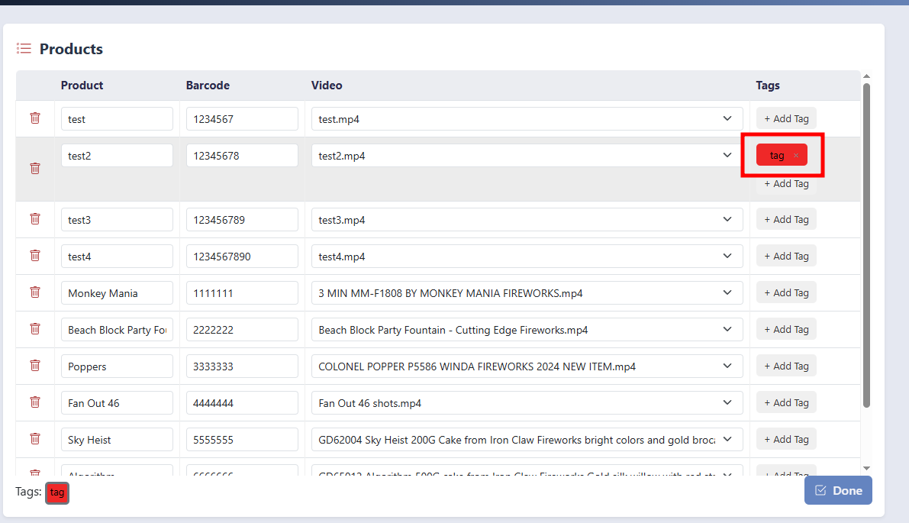

# Product Manager User Guide

## Table of Contents
- [Getting Started](#getting-started)
- [Adding Videos](#adding-videos)
- [Managing Products](#managing-products)
    - [Searching Products](#searching-products)
    - [Tagging Products](#tagging-products)
- [Managing Playlists](#managing-playlists)
    - [Creating Playlist](#creating-playlist)
    - [Adding Playlist Items](#add-to-playlist)
    - [Reordering Playlist Items](#reorder-playlist)
    - [Deleting Playlist](#deleting-playlists)
    - [Deleting Playlist Items](#deleting-playlist-items)

### Getting Started
1. Open the `Manager.exe` application
    - The first time this application is run, it will generate a `Videos` folder and a `config.json` file
    
    
2. Exit the `Manager.exe` program

### Adding Videos
1. After the `Videos` folder is created, you can move or copy all videos you want into it

2. Ideally, you should update the Videos folder videos before opening the Manager.exe application  
But if you added or deleted videos while the manager was open, there is a "Refresh Videos" button  
  
It will put the program into `edit products` mode and remove the assigned videos that were deleted  
  

### Managing Products
1. After your videos are added into the `Videos` folder, you can start up the `Manager.exe` application again
2. Click `edit` in the products section

3. Edit data
    - Add new rows as needed
    
    - Edit Row(s)
    

4. Click `Done` when finished

    - Incomplete Product row
        - If you did not complete any product rows, it will notify you
        
        - Problematic cells are also highlighted in red
        
    - Products are all valid
        - It will prompt you if you are sure you want to save if you have videos that have not been assigned to a product
        
        - Press Continue to save
        

5. If you close out of the program with unsaved changes, it asks for confirmation

#### Searching Products
1. Search in the search box to find only rows you want. It searches all data fields

Fan Out 46 got filtered out

- This works while editing products too  
No filter

#### Tagging Products
1. Create a tag

2. Update the color if desired
    - Click on the tag to edit the color  
    
    

3. Apply tag to product
    - Edit Product Button
    
    - Select the tag at the bottom
        - Selected tag will have a gray outline around it
    
    - After Tag is selected, click `+ Add Tag` button
    
    
4. Click `Done`

Example:

### Managing Playlists
IMPORTANT!! Make sure you always have a Playlist marked "Active"  
If you do not, your system will not be able to play a playlist  

#### Creating Playlist
1. Create Playlist

#### Add to Playlist
1. Select Playlist

2. Select Products with checkboxes
    
    - The last checkbox you clicked will update the Video Preview, in case you need a reminder of what the video is
    
    - Tip: You can use the search feature and then select all
    
    
3. Click `Add to Playlist`
    
    

#### Reorder Playlist
- 2 ways to change order of items
    1. Click the UP/DOWN arrow buttons
    
    2. Click and drag the item
    

#### Deleting Playlists
1. Click the delete button

2. Make sure you have a Playlist marked Active 

#### Deleting Playlist Items
1. Click the delete button

